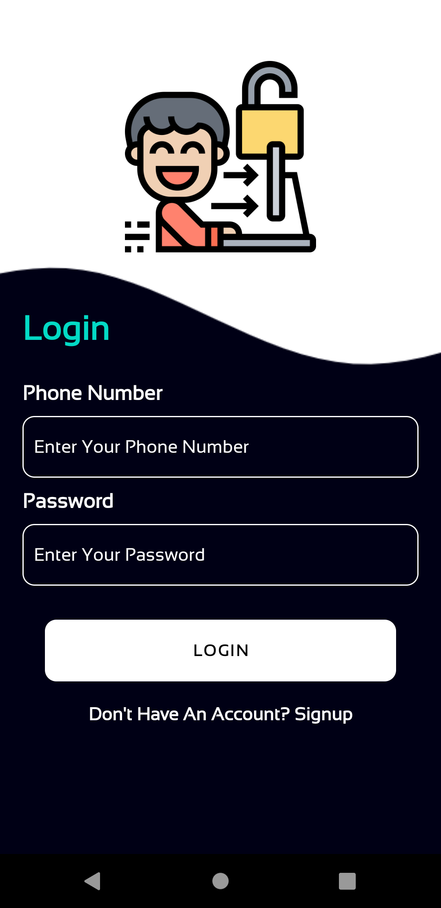
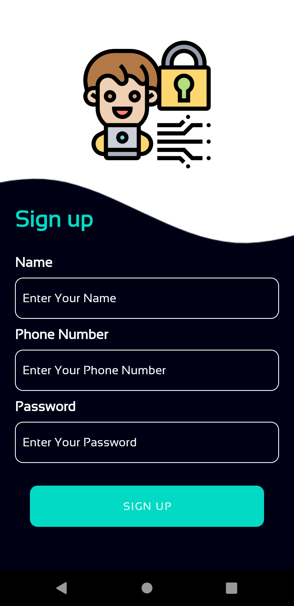
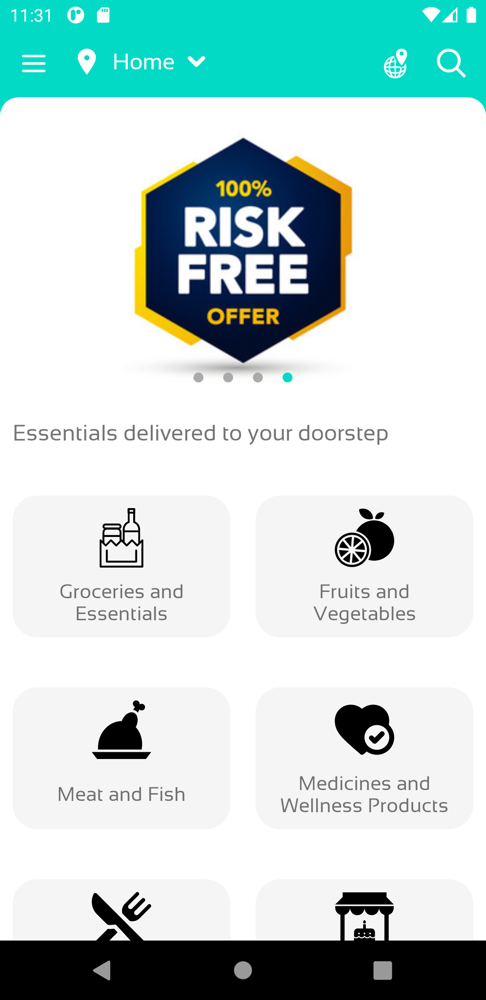
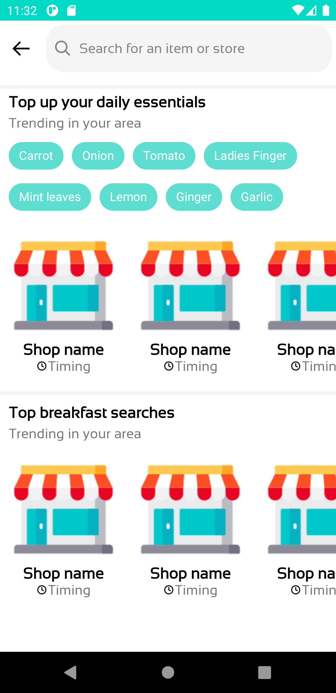
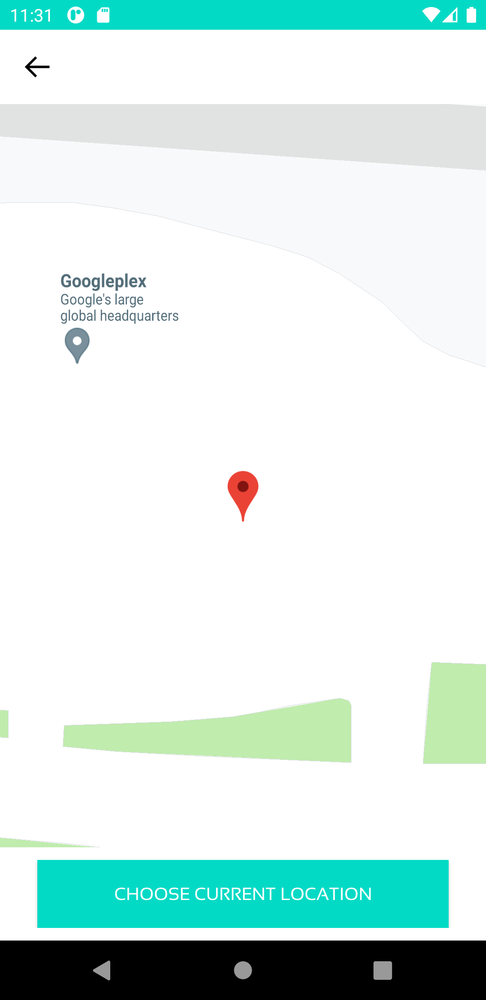
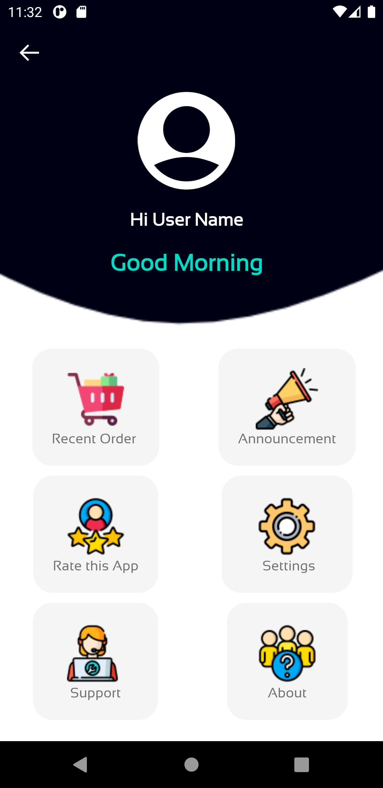
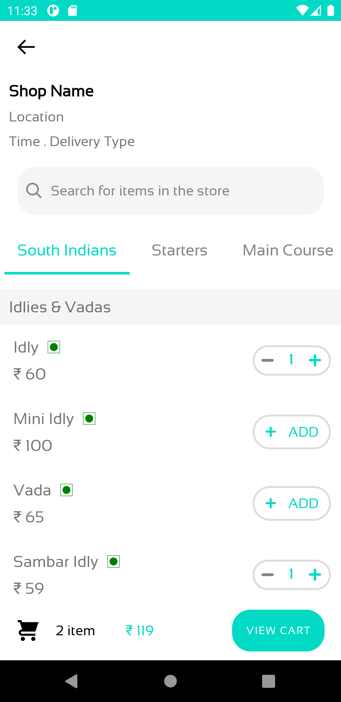

<h2 align="center">
Eatly
</h2>

<h3 align="center">
Native Android food delivery app. Users can order food from their
favourite restaurant and live tracking of order. 
Used Google maps API for live tracking and estimated time of
delivery.

Maintained user account details and credentials in firebase
authentication.
</h3>

<h4 align="center">
Available for Android.
</h4>

 

## Demo

<h4 align="center">
Sign in, up Screens
</h4>

   
   

<h4 align="center">
Home Screens
</h4>

   
   

<h4 align="center">
Google Map Screen
</h4>

   

<h4 align="center">
Additional Screens
</h4>

   
   

